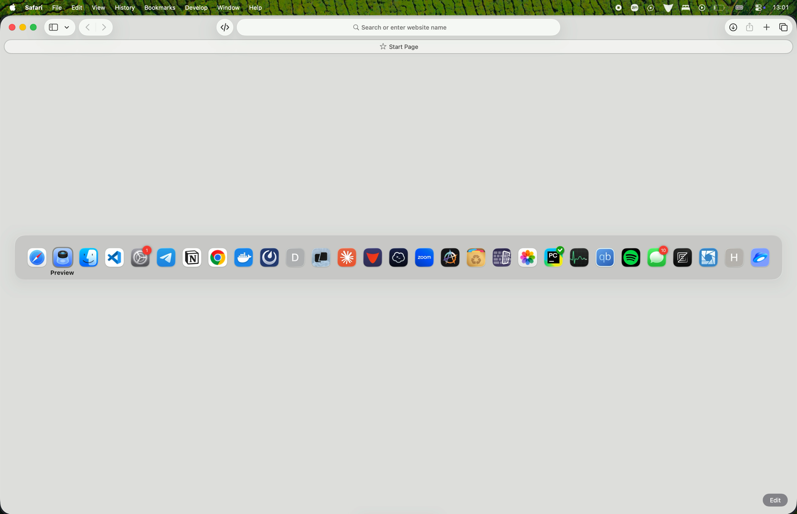
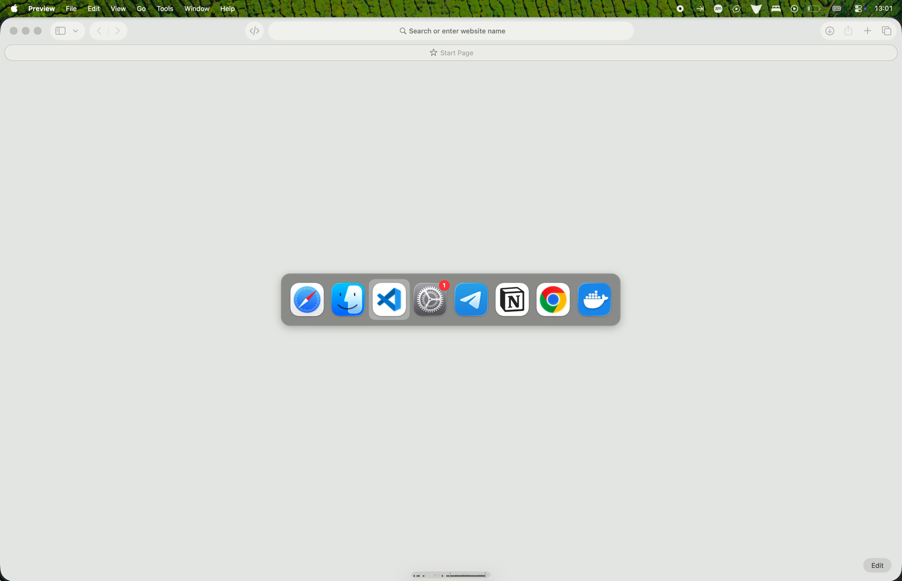
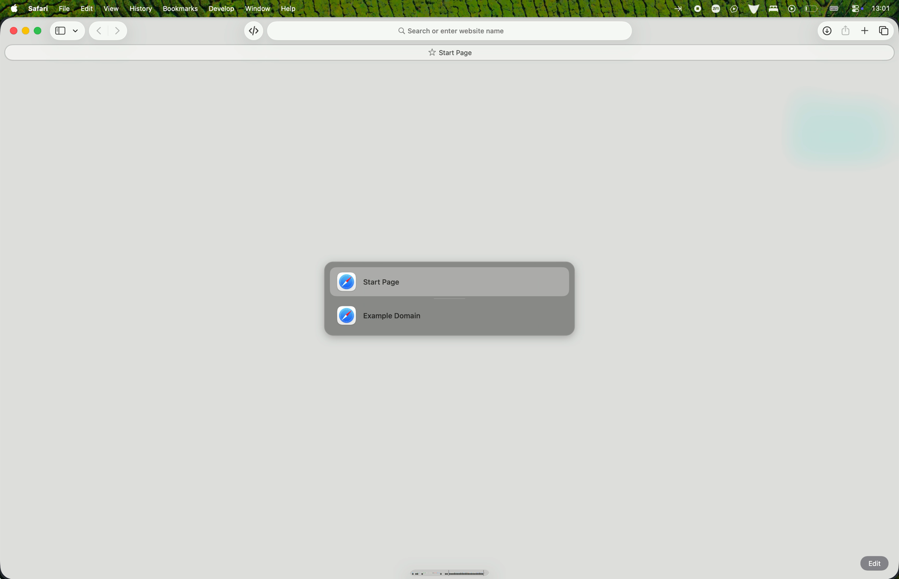

# CleanSwitcher

A minimal Cmd+Tab replacement for macOS.

- Hides apps you haven't used recently
- Clean vertical window switcher
- Apps: your pinned and recent apps, one shortcut away — ⌥ Space, or a lone ⌥ / ⌘ tap
- Trackpad: a 3- or 4-finger swipe (↔ ← → ↕ ↑ ↓) for Apps, the recent app or the recent window (Preferences)

## Install

```bash
curl -fsSL https://raw.githubusercontent.com/marklidenberg/CleanSwitcher/main/install.sh | bash
```

Ad-hoc signed, not notarized.

## Shortcuts

| Key | Action |
|-----|--------|
| Cmd+Tab | Open app switcher |
| Cmd+«key left of 1» | Open window switcher |
| Option+Space | Open Apps |

These, and nothing else: while a switcher is open, only its own key steps (+ Shift back). All three can be changed in Preferences.

## How it looks

### Before (native MacOS Switcher)



### After (CleanSwitcher)



### Windows (CleanSwitcher)




## Credits

A fork of [fad1/Switcher](https://github.com/fad1/Switcher).

## License

MIT
